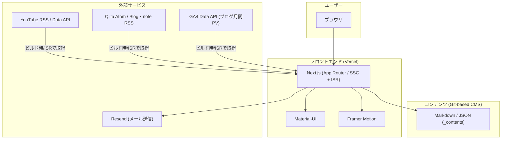
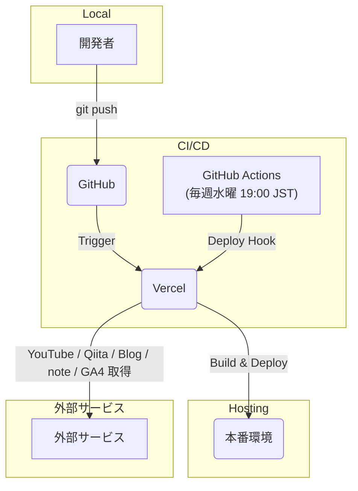

# SHOU's Portfolio

Next.js と Material-UI で構築した、個人事業主 **SHOU（UDKアセットデザイン）** のポートフォリオサイトです。
YouTube を軸としたコンテンツ制作を主軸に、AI × エンジニアリング × FP の知見を1ページにまとめて紹介しています。

公開URL: <https://www.shou-devlog.com/portfolio>

## 概要

このプロジェクトは、AI コーディングエージェント（Claude Code をディレクター兼レビュアー、実装を codex CLI に委譲）を活用して開発しています。
要件定義（`docs/requirements.md`）→ 設計（`docs/design.md`）→ タスク化（`docs/tasks.md`）というステップバイステップのプロセスで、改善フェーズを重ねながら継続的に更新しています。

## 技術スタック

- **フレームワーク**: [Next.js 14](https://nextjs.org/)（App Router / SSG + ISR）
- **UIライブラリ**: [Material-UI (MUI) v5](https://mui.com/)
- **アニメーション**: [Framer Motion](https://www.framer.com/motion/)
- **言語**: TypeScript
- **フォント**: Noto Sans JP
- **ブランドカラー**: ネイビー × アズール
- **コンテンツ**: Markdown / JSON（gray-matter, react-markdown, remark）
- **メール送信**: [Resend](https://resend.com/)（お問い合わせフォーム）
- **分析データ**: Google Analytics Data API (GA4) / YouTube Data API
- **デプロイ**: Vercel（base path: `/portfolio`）

## アーキテクチャ


```mermaid
graph TD
    subgraph "ユーザー"
        A[ブラウザ]
    end

    subgraph "フロントエンド (Vercel)"
        B["Next.js (App Router / SSG + ISR)"]
        C[Material-UI]
        D[Framer Motion]
    end

    subgraph "コンテンツ (Git-based CMS)"
        E["Markdown / JSON (_contents)"]
    end

    subgraph "外部サービス"
        F["Resend (メール送信)"]
        G["YouTube RSS / Data API"]
        H["Qiita Atom / Blog・note RSS"]
        I["GA4 Data API (ブログ月間PV)"]
    end

    A --> B
    B --> C
    B --> D
    B --> E
    B --> F
    G -->|ビルド時/ISRで取得| B
    H -->|ビルド時/ISRで取得| B
    I -->|ビルド時/ISRで取得| B
```

## 主な機能

情報設計はワンページ構成に統一し、以下のセクションを縦に配置しています。

- **ヒーロー / プロフィール**: 自己紹介と、YouTube 登録者数・ブログ月間PVなどの実績数字（Stats Badges）を自動表示
- **スキル**: カテゴリ別（Frontend / Backend / コンテンツ制作 / ライティング・情報発信 / 資格 ほか）のスキル一覧を `skills.json` から生成
- **プロジェクト**: 旗艦プロジェクト `yt-factory` を含む実績を読みやすい縦型モーダルで詳細表示。構成図・画像は全画面で拡大・原寸表示でき、スマホやキーボード操作にも対応
- **経歴（Career）**: これまでの職務経歴をタイムライン表示
- **アウトプット（Outputs）**: AIの実践と知見共有を代表記事とともに紹介。Qiita・Blog・note の最新3記事を Atom / RSS から自動取得し、YouTube 最新動画も表示
- **お問い合わせ**: Resend を利用したメール送信フォーム
- **レスポンシブデザイン**: PC・モバイル両対応、iOS 向けアイコン最適化
- **SEO 基盤**: `sitemap.xml` / `robots.txt` / OGP 画像 / JSON-LD 構造化データ

### 実績数字の自動取得

- **YouTube 登録者数など**: YouTube Data API（`YOUTUBE_API_KEY`）でチャンネル統計を取得
- **ブログ月間PV**: Google Analytics Data API (GA4) から直近30日の PV を取得
- いずれもビルド時に取得し、ISR（24時間）で更新されます

## ディレクトリ構成

```
.
├── .github/
│   └── workflows/
│       └── weekly-rebuild.yml   # 毎週水曜のVercel定期リビルド
├── _contents/                   # コンテンツ (Git-based CMS)
│   ├── career/                  # 職務経歴 (Markdown)
│   ├── projects/                # プロジェクト詳細 (Markdown)
│   ├── self-introduction.md     # 自己紹介
│   └── skills.json              # スキルデータ
├── docs/                        # 開発ドキュメント (要件/設計/タスク)
├── public/                      # 静的アセット (OGP, 画像 など)
├── scripts/
│   └── check-stats.mjs          # 実績数字の取得確認スクリプト
├── src/
│   ├── app/                     # App Router
│   │   ├── api/contact/         # お問い合わせAPIルート (Resend)
│   │   ├── projects/[id]/       # プロジェクト詳細ページ
│   │   ├── page.tsx             # トップ (ワンページ) + JSON-LD
│   │   ├── layout.tsx           # metadata / OGP / フォント
│   │   ├── sitemap.ts           # sitemap.xml
│   │   └── robots.ts            # robots.txt
│   ├── components/
│   │   ├── sections/            # 各セクション (Skills/Projects/Outputs 等)
│   │   └── *.tsx                # Header, Footer, Layout, StatsBadges 等
│   ├── lib/
│   │   ├── youtube.ts           # YouTube RSS / Data API 取得
│   │   ├── feeds.ts             # Qiita Atom / Blog・note RSS 取得
│   │   ├── analytics.ts         # GA4 ブログ月間PV取得
│   │   └── stats.ts             # 実績数字のフォーマット
│   └── theme.ts                 # MUIテーマ (ブランドカラー / フォント)
├── next.config.js               # basePath, redirects, 画像設定
├── package.json
└── README.md
```

## 開発プロセス

「要件定義 → 設計 → タスク化」というステップバイステップのプロセスで進めています。

- **要件定義** (`docs/requirements.md`): 「何を」作るか。必要な機能と受け入れ基準を定義する。
- **設計** (`docs/design.md`): 「どのように」作るか。技術アーキテクチャやデータモデルを定義する。
- **タスク化** (`docs/tasks.md`): 実装の具体的な手順をリスト化し、1タスクずつ着実に実装を進める。

## ワークフロー


```mermaid
graph TD
    A[開発者] -->|git push| B(GitHub)
    B -->|Trigger| C(Vercel)
    C -->|Build & Deploy| D(本番環境)
    E["GitHub Actions\n(毎週水曜 19:00 JST)"] -->|Deploy Hook| C
    C -->|YouTube / Qiita / Blog / note / GA4 取得| F[外部サービス]

    subgraph "Local"
      A
    end

    subgraph "CI/CD"
      B
      C
      E
    end

    subgraph "Hosting"
      D
    end

    subgraph "外部サービス"
      F
    end
```

### 定期ビルド（実績数字・最新記事の更新）

毎週水曜日 19:00 JST に GitHub Actions が Vercel の Deploy Hook を呼び出し、サイトを自動リビルドします。
リビルド時に YouTube・Qiita・Blog・note の各フィードと実績数字を取得し直すことで、Outputs や Stats Badges が常に最新の状態を保ちます。

**設定方法**（初回のみ）:
1. Vercelダッシュボード → Settings → Git → Deploy Hooks でフック URL を発行
2. GitHubリポジトリ → Settings → Secrets → `VERCEL_DEPLOY_HOOK_URL` に登録

### 環境変数

`.env`（および Vercel の環境変数）に以下を設定します。

| 変数名 | 用途 |
| --- | --- |
| `RESEND_API_KEY` | お問い合わせフォームのメール送信 |
| `YOUTUBE_API_KEY` | YouTube チャンネル統計（登録者数など）の取得 |
| `GA4_PROPERTY_ID` | GA4 プロパティ ID（ブログ月間PV） |
| `GA4_CLIENT_EMAIL` | GA4 サービスアカウントのメールアドレス |
| `GA4_PRIVATE_KEY` | GA4 サービスアカウントの秘密鍵 |

## 実行方法

```bash
npm install
npm run dev        # 開発サーバー起動
npm run build      # 本番ビルド
npm start          # 本番サーバー起動
npm run lint       # ESLint
npm run test:feeds # RSS / Atom の回帰テスト
```

### 記事の表示と更新

- 記事一覧は公開日順で各媒体3件、24時間ごとに再検証します。取得が失敗した場合は媒体へのリンクと案内を表示します。
- AIの代表記事は `src/components/outputs/AiWritingFeature.tsx` の `articles` で編集します。新着一覧とは別に固定表示されます。
- Qiitaは公開Atomフィードを利用するため、追加のAPIキー設定は不要です。
