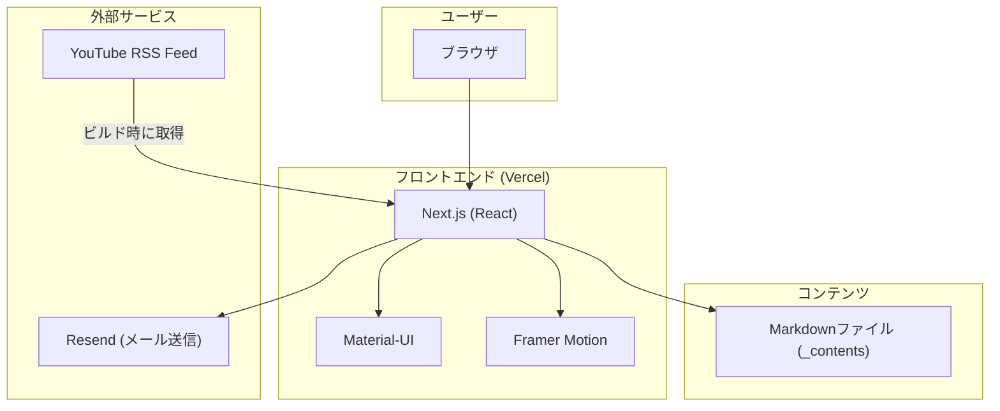
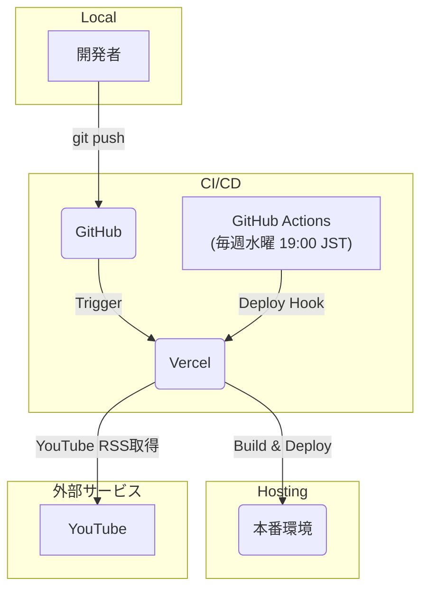

# SHOU's Portfolio

これは、Next.jsとMaterial-UIを使用して構築されたポートフォリオサイトです。

## 概要

このプロジェクトは、Gemini CLIを活用して開発されました。要件定義から設計、実装、デプロイまで、一連の開発プロセスをGemini CLIと対話しながら進めています。

## 技術スタック

- **フレームワーク**: [Next.js](https://nextjs.org/)
- **UIライブラリ**: [Material-UI (MUI)](https://mui.com/)
- **アニメーション**: [Framer Motion](https://www.framer.com/motion/)
- **言語**: TypeScript
- **デプロイ**: Vercel

## アーキテクチャ


```mermaid
graph TD
    subgraph "ユーザー"
        A[ブラウザ]
    end

    subgraph "フロントエンド (Vercel)"
        B["Next.js (React)"]
        C[Material-UI]
        D[Framer Motion]
    end

    subgraph "コンテンツ"
        E["Markdownファイル (_contents)"]
    end

    subgraph "外部サービス"
        F["Resend (メール送信)"]
        G["YouTube RSS Feed"]
    end

    A --> B
    B --> C
    B --> D
    B --> E
    B --> F
    G -->|ビルド時に取得| B
```

## 主な機能

- **トップページ**: 自己紹介、スキル、実績、アウトプット、お問い合わせフォームを掲載
- **経歴ページ**: これまでの職務経歴を掲載
- **レスポンシブデザイン**: PC、モバイルの両方で閲覧可能
- **お問い合わせフォーム**: Resendを利用したメール送信機能
- **YouTube最新動画表示**: ビルド時にYouTube RSSフィードを取得し、最新4本の動画サムネイルを自動表示（ISR 24時間）

## ディレクトリ構成

```
.
├── .github/
│   └── workflows/
│       └── weekly-rebuild.yml  # 毎週水曜日の定期Vercelビルド
├── _contents/         # マークダウンコンテンツ
├── docs/              # 開発ドキュメント
├── public/            # 静的アセット
├── src/
│   ├── app/           # App Router
│   │   ├── api/       # APIルート
│   │   └── (routes)/  # 各ページ
│   ├── components/    # 再利用可能なコンポーネント
│   └── lib/
│       └── youtube.ts # YouTube RSSフィード取得ユーティリティ
├── package.json
└── README.md
```

## 開発プロセス

開発は以下のドキュメントに基づいて進められています。
「要件定義 → 設計 → タスク化」 というステップバイステップのプロセスを踏んでいきます。

- **要件定義**: `docs/requirements.md`
- **設計**: `docs/design.md`
- **タスク管理**: `docs/tasks.md`

### 要件定義

- `requirements.md`に要件を記載する。
- 「何を」作るかを定義する。
- どのような機能が必要で、どのような基準を満たせば完成と見なすか（受け入れ基準）を記載する。
- 各要件がテストケースに変換できる。

### 設計

- `design.md`に設計情報を記載する。
- 「どのように」作るかを定義する。
- 技術的なアーキテクチャ、シーケンス図、クラス図、データモデルなどを記載する。
- システムの全体像を把握できる。

### タスク化

- `tasks.md`に記載する。
- 実装の具体的な手順をリスト化する。
- 実装計画をたてることで、AIに1タスクずつ着実に実装を進めてもらう。

## ワークフロー


```mermaid
graph TD
    A[開発者] -->|git push| B(GitHub)
    B -->|Trigger| C(Vercel)
    C -->|Build & Deploy| D(本番環境)
    E["GitHub Actions\n(毎週水曜 19:00 JST)"] -->|Deploy Hook| C
    C -->|YouTube RSS取得| F[YouTube]

    subgraph "Local"
      A
    end

    subgraph "CI/CD"
      B
      C
      E
    end

    subgraph "Hosting"
      D
    end

    subgraph "外部サービス"
      F
    end
```

### 定期ビルド（YouTube最新動画更新）

毎週水曜日 19:00 JST に GitHub Actions がVercelのDeploy Hookを呼び出し、サイトを自動リビルドします。
リビルド時にYouTube RSSフィードから最新動画を取得し直すことで、Outputsページの動画一覧が常に最新の状態を保ちます。

**設定方法**（初回のみ）:
1. Vercelダッシュボード → Settings → Git → Deploy Hooks でフック URLを発行
2. GitHubリポジトリ → Settings → Secrets → `VERCEL_DEPLOY_HOOK_URL` に登録

## 実行方法

```bash
npm install
npm run dev
```